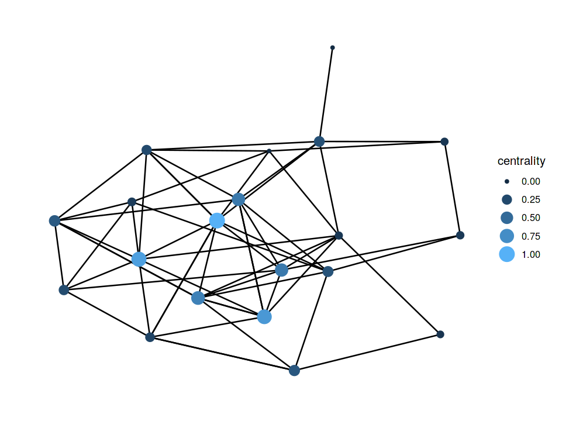
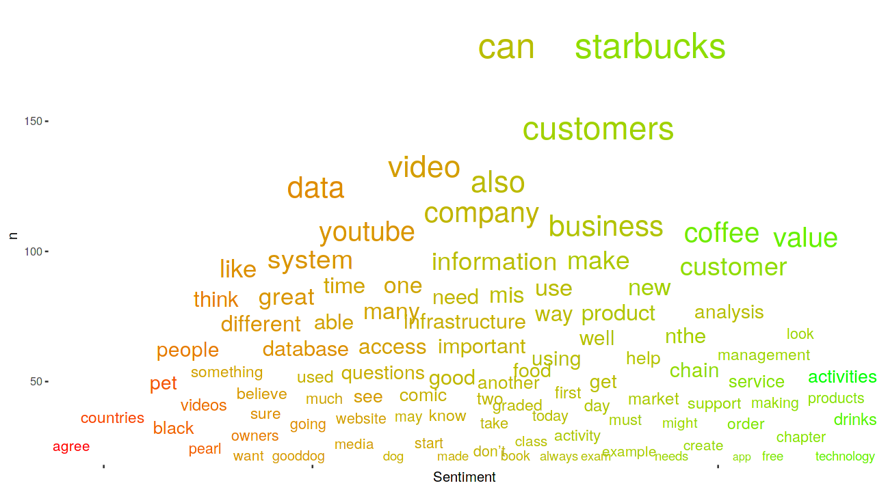
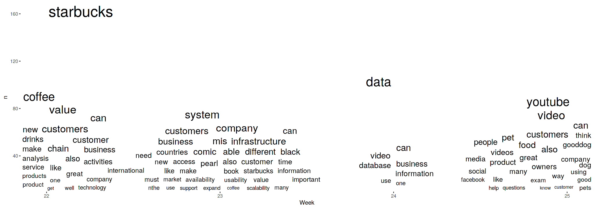
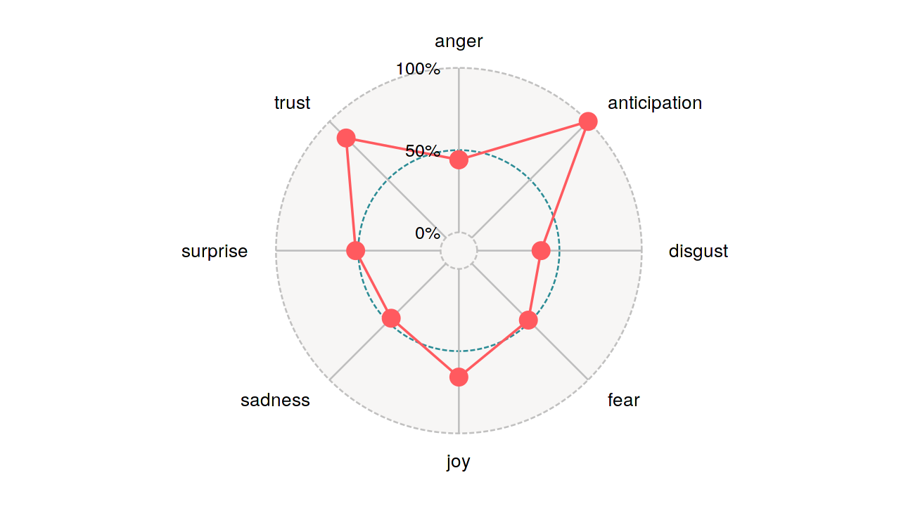
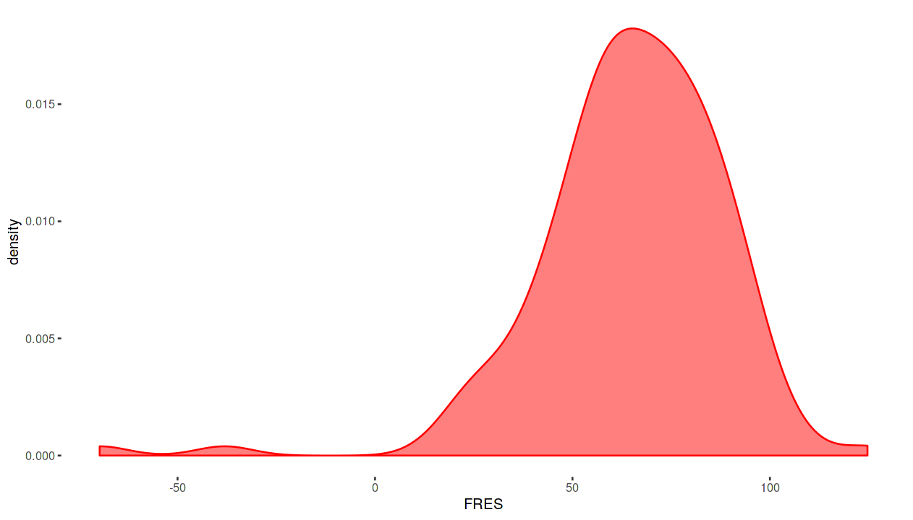
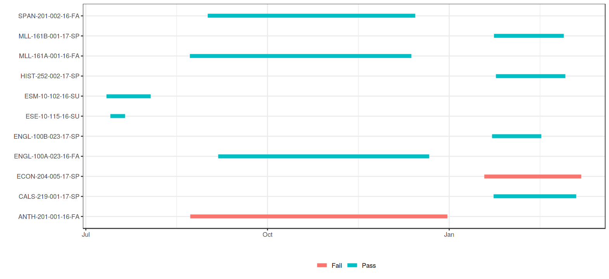
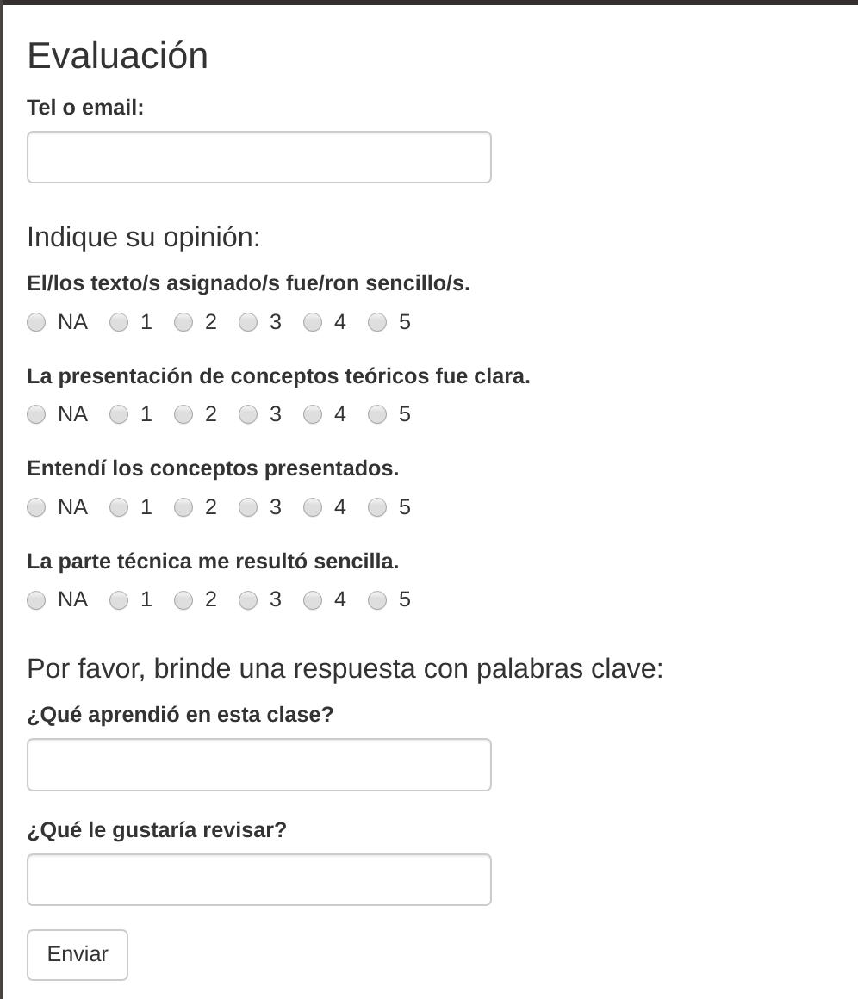

```{r setup, include=FALSE}
knitr::opts_chunk$set(echo = FALSE)
library(tidyverse,quietly = TRUE)
library(ggthemes)
library(sashaUseful)
theme_set(theme_tufte())
```

# State of the Art

* Review Articles
  * @Viberg2018 
  * @Viera2018 

* Interviews with Researchers
* Questionnaires
* 60+ Recent Publications
* LAK 2018 conference presentations

# Review I

Viberg et al. (2018)

* 252 Papers published between 2012-2018
* Four research questions:
  * Does LA improve outcomes?
  * Does it support Learning and Teaching?
  * Is it widely deployed?
  * Is it used ethically?
  
# Review I

```{r, fig.cap="Viberg & al.(2018)", fig.width=10,fig.height=4.5}

myData <- tibble::tribble(
  ~Q, ~ V,
   "Improve Outcomes", .09,
   "Support Learning and Teaching", .35,
   "Widely Deployed", .06,
   "Ethically Used", .18
)
# Learning analytics can improve learning practice by transforming the ways we support learning processes. This study is based on the analysis of 252 papers on learning analytics in higher education published between 2012 and 2018. The main research question is: What is the current scientific knowledge about the application of learning analytics in higher education? The focus is on research approaches, methods and the evidence for learning analytics. The evidence was examined in relation to four earlier validated propositions: whether learning analytics i) improve learning outcomes, ii) support learning and teaching, iii) are deployed widely, and iv) are used ethically. The results demonstrate that overall there is little evidence that shows improvements in students' learning outcomes (9%) as well as learning support and teaching (35%). Similarly, little evidence was found for the third (6%) and the forth (18%) proposition. Despite the fact that the identified potential for improving learner practice is high, we cannot currently see much transfer of the suggested potential into higher educational practice over the years. However, the analysis of the existing evidence for learning analytics indicates that there is a shift towards a deeper understanding of students’ learning experiences for the last years.

myData %>% 
  ggplot(aes(fct_relevel(Q,c("Improve Outcomes", "Support Learning and Teaching", "Widely Deployed","Ethically Used")),V))+
  geom_col(width = .5)+
  geom_text(aes(label=paste(V*100,"%")),nudge_y =.01)+
  scale_y_continuous(labels = scales::percent)+
  xlab("Question")+ylab("") -> p1
p1
```

# Compare to Ed-Tech
```{r, fig.cap="Lea(R)n, Inc.", fig.width=10, fig.height=4.5}
# 9% Met full goals
# 35% Never activated
# 24% Activated but met 0% of goals
# 32% Met < 50% of goals.
myData <- tribble(
  ~Q,~V,
"Met full goals", .09,
"Never activated", .35,
"Activated but Met 0% of Goals", .24,
"Met < 25% of Goals.", .32
)

myData %>% 
  ggplot(aes(fct_relevel(Q,c("Met full goals","Never activated","Activated but Met 0% of Goals","Met < 25% of Goals.")),V))+
  geom_col(width = .5)+
   geom_text(aes(label=paste(V*100,"%")),nudge_y =.01)+
  scale_y_continuous(labels = scales::percent)+
  xlab("Metric")+ylab("")

```

# Review I
```{r, fig.cap="Viberg & al.(2018)", fig.width=10,fig.height=4.5}
p1
```

# Review I

"However, the analysis of the existing evidence for learning analytics indicates that there is a shift towards a deeper understanding of students’ learning experiences for the last years."

>> --@Viberg2018

# Review II

1. Lack of visual learning analytics tools in classroom settings;
2. Few consider background information such as demographics or prior performance;
3. Traditional statistical visualization techniques, such as bar plots and scatter plots still predominant in learning analytics contexts;
4. Lack of studies that both employ sophisticated visualizations and engage deeply with educational theories.


>> --@Viera2018

# Review III

## LAK 2018

* Only 7 out of 70 articles on "At-Risk" students
* Unit of analysis is changing
* Goals are changing
* More/different data is being analyzed

# Interviews

* Improving the educational experience beyond academic achievement is now a stated goal
* Field is mature on the research side, industry struggling to catch up
* Adoption is still a huge problem
* Scalability and generalization not trivial

# Interviews

Have we solved the problem of identifying students at risk?

# Interviews

Have we solved the problem of identifying students at risk?

 -- Yes and No!

# Interviews

Have we solved the problem of identifying students at risk?

 -- Yes and No!

* Statistical techniques are there, tested and validated.

# Interviews

Have we solved the problem of identifying students at risk?

 -- Yes and No!

* Statistical techniques are there, tested and validated.
* Generalizations are problematic.

# Context is Important

"Learning analytics should not promote one size fits all: The effects of instructional conditions in predicting academic success."

>> --@GASEVIC201668

# Example: Nudge Wars

* National Bureau of Economics: "Study Finds Large-Scale 'Nudging' Misses the Target"
* Persistence Plus: Not so!

# Example: Nudge Wars

* National Bureau of Economics: "Study Finds Large-Scale 'Nudging' Misses the Target"
* Persistence Plus: Not so!
  * "The researchers emphasized that there were "some limitations" in using this method of measuring. Those who choose not to engage in support services 'may differ' from those who are willing to take help. And those who opted out from the nudging may have simply chosen not to continue in college."
  
# Example: Nudge Wars

* National Bureau of Economics: "Study Finds Large-Scale 'Nudging' Misses the Target"
* Persistence Plus: Not so!
  * "The researchers emphasized that there were "some limitations" in using this method of measuring. Those who choose not to engage in support services 'may differ' from those who are willing to take help. And those who opted out from the nudging may have simply chosen not to continue in college."

# Example: Nudge Wars

* The researchers proved that those students who *chose* to receive *nudges*, responded better than those who did not. 
* This is a classic case of confounded variables. 
* It might be surmised that the conclusions were biased by the institutions for-profit status. 

# Example: Nudge Wars

"It was also found that the effect was stronger for people of color [...] and people over 25 years of age."

* Asserted without any explanatory model
* Probably irrelevant as we are already dealing with confounded variables.

# Some trends

* Advantages are better understood
* Additional data-sources
* Social Network Analysis, Linguistic Analysis
* More attention paid to the connection between LA and learning design

# Some trends

* Push to extend to an institutional level
* Taking LA to emerging countries (EU funded)
* Privacy, ethics and equity
* Longitudinal studies
* K-12 included
* Taking on the task of providing data-literacy

# Data Literacy

* Measures of central tendency
* Descriptive, inferential, predictive
* Correlation is **not** causation
* Confusion Matrix
* Accuracy vs. Interpretability


Too much "dumbing down" renders the analysis useless

# Cognitive Bias: Causal Flow

```{r, fig.cap="Dwell-time by Grade", fig.width=10,fig.height=4.5}
ggplot(data = data.frame(x = 0), mapping = aes(x = x)) ->p

fun.1 <- function(x) 1+x*2.7
p <- p +
  ylab("")+xlab("Dwell-Time")+
   xlim(0,1)+
  scale_y_continuous(breaks = c(0,.9,1.8,2.7,3.6), labels=c("F","D","C","B","A"),
                     limits = c(0,4))+
   theme(
     #axis.title.x=element_blank(),
        axis.text.x=element_blank()
        #axis.ticks.x=element_blank()
        
        )
p + stat_function(fun = fun.1, color="red")
```

# Cognitive Bias: Causal Flow

```{r, fig.cap="Dwell-time by Grade", fig.width=10,fig.height=4.5}
fun.2 <- function(x) dgamma(x,2,9)
p+stat_function(fun = fun.2, color="red")
```

# Cognitive Bias: Causal Flow

```{r, fig.cap="Dwell-time by Grade", fig.width=10,fig.height=4.5}
p+stat_function(fun = fun.2, color="red")+
  geom_vline(xintercept = .12, lty=2, color='blue')
```


# Cognitive Bias: Survival Bias

"Our first-year drop-out rates are sky-high compared to later years"

# Bias: Procrastinationism

# Bias: Procrastinationism

* Study Habits
  * "Binging" seen as negative
  * Easy to detect, especially in an LMS (entropy)
  * Causal link unclear (e.g. context needed)
  * Self-reporting shows low/no correlation between perception and behavior
  
# On the rise: Social Network Analysis




# On the rise: Linguistic Analysis


# On the rise: Linguistic Analysis



# On the rise: Linguistic Analysis


# On the rise: Linguistic Analysis


# LMS Data Standards Lagging

* Caliper data collected on e.g. Discussion Posts *do not* include the actual text. 
* Closest "Linguistic" measure is *post-length*.
* This effectively eliminates 85% of the data (@dietrichson2013)

# Example: FRES


# Example: Post-length vs. FRES

* FRES r-squared --> .3
* Post-length r-squared --> .005

# Example: Post-length vs. other Metrics

Beating Post-length are: 

* Word-count, 
* TTR (lexical density)
* CTC
* even *MSS*

# On the rise: Learning Path Analysis


# On the rise: Learning Path Analysis


# On the rise: Analytics in the classroom


# Aspirations for the Future

* More rigor
* Describe impact (better)
* Research into practice
* Generalizability

# References {-}
