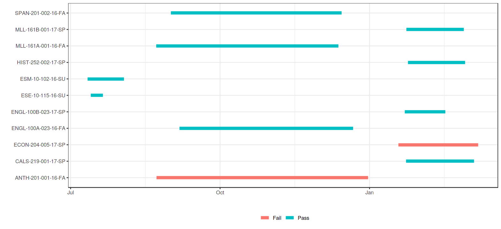
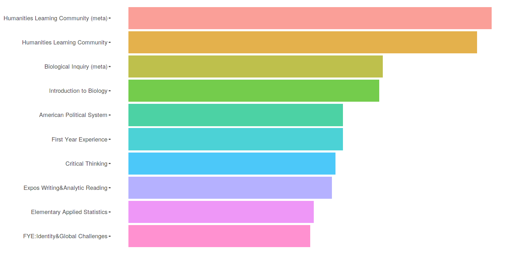
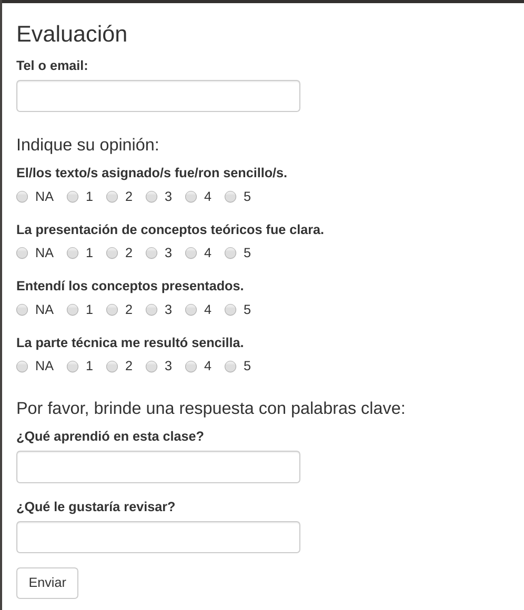
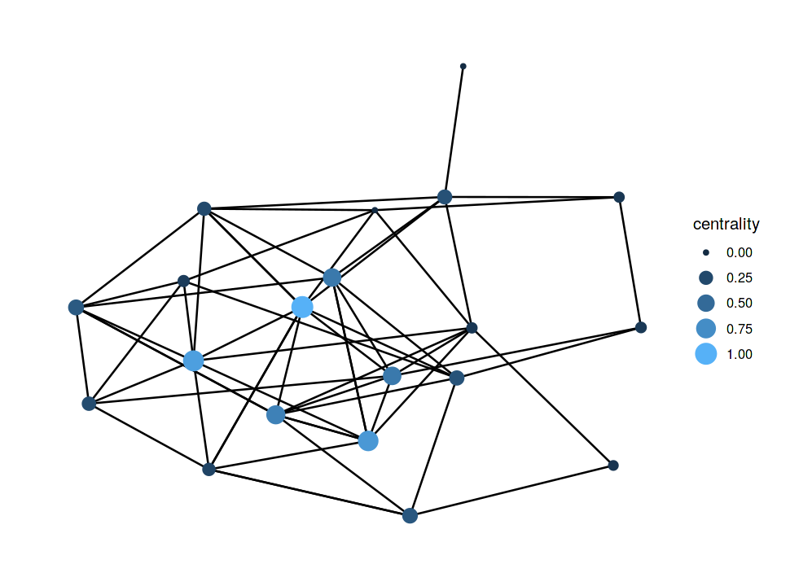
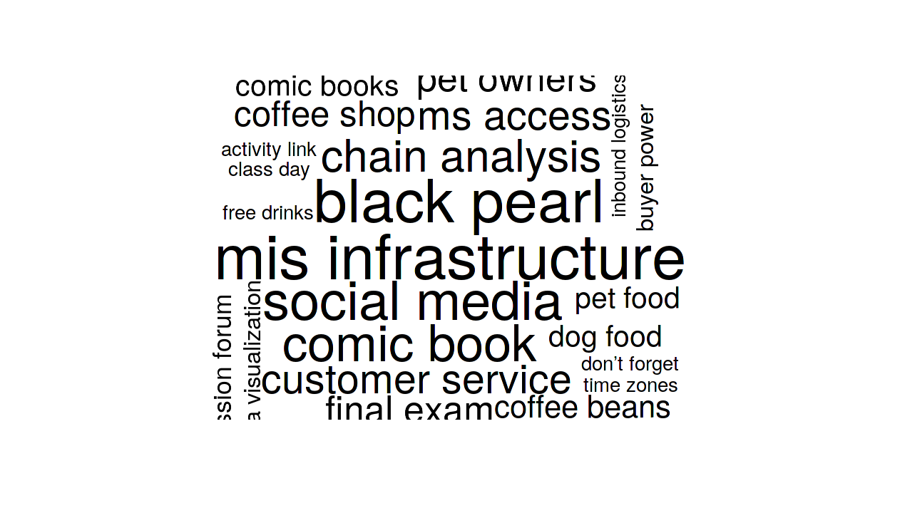
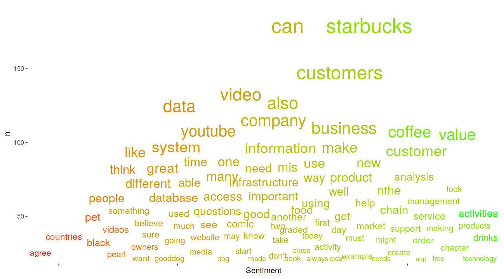
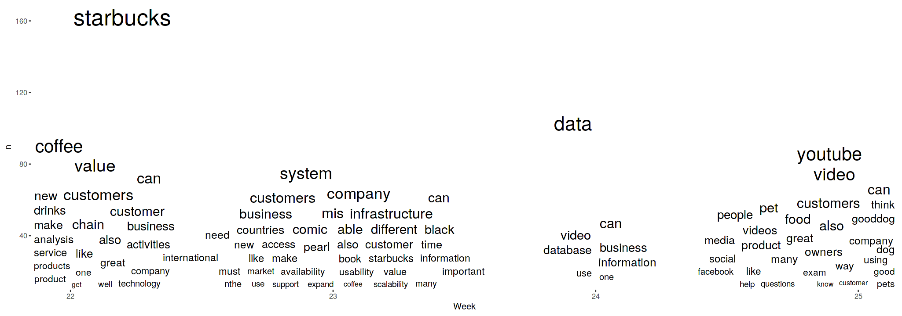
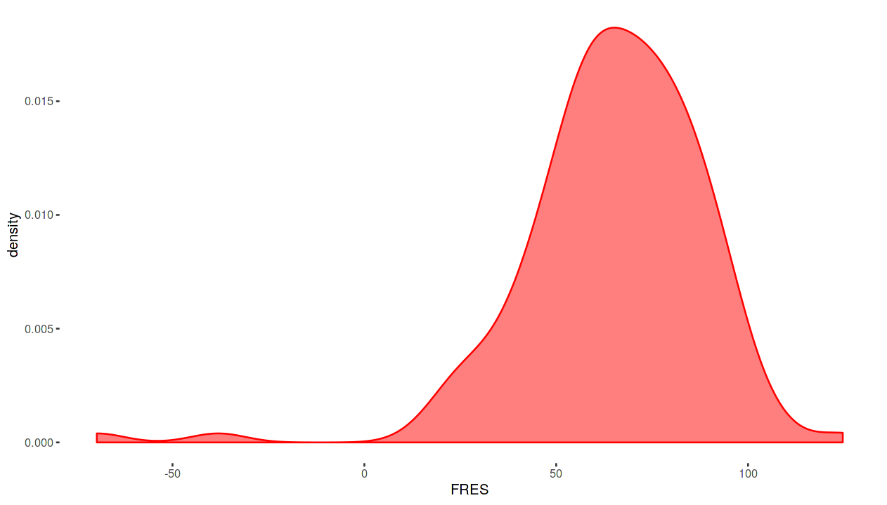

```{r setup, include=FALSE}
knitr::opts_chunk$set(echo = FALSE)
library(tidyverse,quietly = TRUE)
library(ggthemes)
library(sashaUseful)
theme_set(theme_tufte())
```

# ¿Qué es la analítica del aprendizaje?

> el uso de datos inteligentes, datos producidos por el alumno y modelos de análisis para descubrir información y conexiones sociales para predecir y asesorar el aprendizaje de las personas

# Fuentes de datos

- LMS (moodle)
- SIS (guaraní)
- Encuestas
- Evaluaciones

# Ejemplo: «Learning Path Analysis»


# Ejemplo: «Learning Path Analysis»


# Ejemplo: «Encuestas»


# Estado

```{r, fig.cap="Viberg & al.(2018)", fig.width=10,fig.height=4.5}

myData <- tibble::tribble(
  ~Q, ~ V,
   "Improve Outcomes", .09,
   "Support Learning and Teaching", .35,
   "Widely Deployed", .06,
   "Ethically Used", .18
)
# Learning analytics can improve learning practice by transforming the ways we support learning processes. This study is based on the analysis of 252 papers on learning analytics in higher education published between 2012 and 2018. The main research question is: What is the current scientific knowledge about the application of learning analytics in higher education? The focus is on research approaches, methods and the evidence for learning analytics. The evidence was examined in relation to four earlier validated propositions: whether learning analytics i) improve learning outcomes, ii) support learning and teaching, iii) are deployed widely, and iv) are used ethically. The results demonstrate that overall there is little evidence that shows improvements in students' learning outcomes (9%) as well as learning support and teaching (35%). Similarly, little evidence was found for the third (6%) and the forth (18%) proposition. Despite the fact that the identified potential for improving learner practice is high, we cannot currently see much transfer of the suggested potential into higher educational practice over the years. However, the analysis of the existing evidence for learning analytics indicates that there is a shift towards a deeper understanding of students’ learning experiences for the last years.

myData %>% 
  ggplot(aes(fct_relevel(Q,c("Improve Outcomes", "Support Learning and Teaching", "Widely Deployed","Ethically Used")),V))+
  geom_col(width = .5)+
  geom_text(aes(label=paste(V*100,"%")),nudge_y =.01)+
  scale_y_continuous(labels = scales::percent)+
  xlab("Question")+ylab("") -> p1
p1
```


# ¿Quo vadis?

"However, the analysis of the existing evidence for learning analytics indicates that there is a shift towards a deeper understanding of students’ learning experiences for the last years."

>> --@Viberg2018

# Tendencias del campo

* Mayor apreciación de sus ventajas
* More attention paid to the connection between LA and learning design
* Estudios longitudinales
* Redes sociales y análisis lingüístico 

  
# En auge: Analisis de redes sociales




# En auge: Análisis lingüístico



# Análisis lingüístico



# Análisis lingüístico


# Análisis lingüístico


# Problemas encontrados

* Datos de «Caliper»  *no incluyen* el texto.
* Unica medida remotamente lingüístico es *post-length* (largo en caracteres).
* Con lo cual estamos ignorando el 85% of the data [@dietrichson2013]

# Example: FRES


# Example: Post-length vs. FRES

* FRES r-squared --> .3
* Post-length r-squared --> .005

# Example: Post-length vs. other Metrics

Beating Post-length are: 

* Word-count, 
* TTR (lexical density)
* CTC
* even *MSS*

# Problemas encontrados: FRES en español

- la versión en inglés de basa en una formula
  206 - (palabras / oraciones ) - 84,6 (sílabas / palabras )
- las variables son:
  - número de sílabas 
  - número de palabras 
  - número de oraciones
- No directamente transferible al español por las diferencias de los sistemas morfo-sintácticas


# Posibles soluciones

- Derivar otra fórmula
- Usar IA


# References {-}
